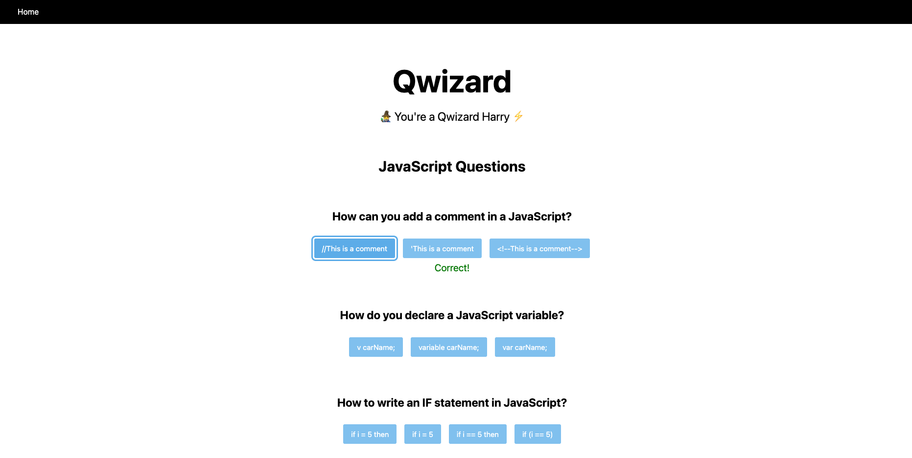

<!-- HEADER -->
<p align="center">
  <h3 align="center">Qwizard</h3>

  <p align="center">
    A quiz application designed to help learn coding!
    <br />
    <a href="https://github.com/bwolfenberger/Qwizard"><strong>Explore the docs »</strong></a>
    <br />
    <br />
    <a href="">View Demo</a>
    ·
    <a href="https://github.com/bwolfenberger/Qwizard/issues">Report Bug</a>
    ·
    <a href="https://github.com/bwolfenberger/Qwizard/issues">Request Feature</a>
  </p>
</p>


<!-- TABLE OF CONTENTS -->
<details open="open">
  <summary>Table of Contents</summary>
  <ol>
    <li>
      <a href="#about-the-project">About The Project</a>
      <ul>
        <li><a href="#built-with">Built With</a></li>
      </ul>
    </li>
    <li>
      <a href="#getting-started">Getting Started</a>
      <ul>
        <li><a href="#prerequisites">Prerequisites</a></li>
        <li><a href="#installation">Installation</a></li>
      </ul>
    </li>
    <li><a href="#usage">Usage</a></li>
    <li><a href="#roadmap">Roadmap</a></li>
    <li><a href="#contributing">Contributing</a></li>
    <li><a href="#license">License</a></li>
    <li><a href="#contact">Contact</a></li>
    <li><a href="#acknowledgements">Acknowledgements</a></li>
  </ol>
</details>


<!-- ABOUT THE PROJECT -->
## About The Project



Quizard is a quiz app to help with learning key concepts for computer science related topics.

I built this application as part of a three-day sprint with a new technology. Due to the short time, I needed to learn in an efficient manner.

Data parsing was also a big emphasis for this project which is why I wanted to use an API with many layers to the data.

### Built With

* [Next.js](https://nextjs.org/)
* [TypeScript](https://www.typescriptlang.org/)
* [JavaScript](https://www.javascript.com/)
* [Fetch API](https://developer.mozilla.org/en-US/docs/Web/API/Fetch_API)


<!-- GETTING STARTED -->
## Getting Started

To get started you will have to clone down the code then follow along with the below instructions.

### Prerequisites

* npm
  ```sh
  npm install npm@latest -g
  ```

### Installation

1. Get a free API Key at [https://quizapi.io](https://quizapi.io/docs/1.0/overview)
2. Clone the repo
   ```sh
   git clone https://github.com/bwolfenberger/Qwizard.git
   ```
3. Install NPM packages
   ```sh
   npm install
   ```
4. Enter your API in `.env.local`
   ```JS
   QUIZ_API_KEY = 'ENTER YOUR API'
   ```


<!-- USAGE EXAMPLES -->
<!-- ## Usage

Use this space to show useful examples of how a project can be used. Additional screenshots, code examples and demos work well in this space. You may also link to more resources.

_For more examples, please refer to the [Documentation](https://example.com)_ -->


<!-- ROADMAP -->
## Roadmap

See the [open issues](https://github.com/bwolfenberger/Qwizard/issues) for a list of proposed features (and known issues).


<!-- CONTRIBUTING -->
## Contributing

Contributions are what make the open source community such an amazing place to be learn, inspire, and create. Any contributions you make are **greatly appreciated**.

1. Fork the Project
2. Create your Feature Branch (`git checkout -b feature/AmazingFeature`)
3. Commit your Changes (`git commit -m 'Add some AmazingFeature'`)
4. Push to the Branch (`git push origin feature/AmazingFeature`)
5. Open a Pull Request


<!-- CONTACT -->
## Contact

Benji Wolfenberger - bwolfenberger@gmail.com

Project Link: [https://github.com/bwolfenberger/Qwizard](https://github.com/bwolfenberger/Qwizard)